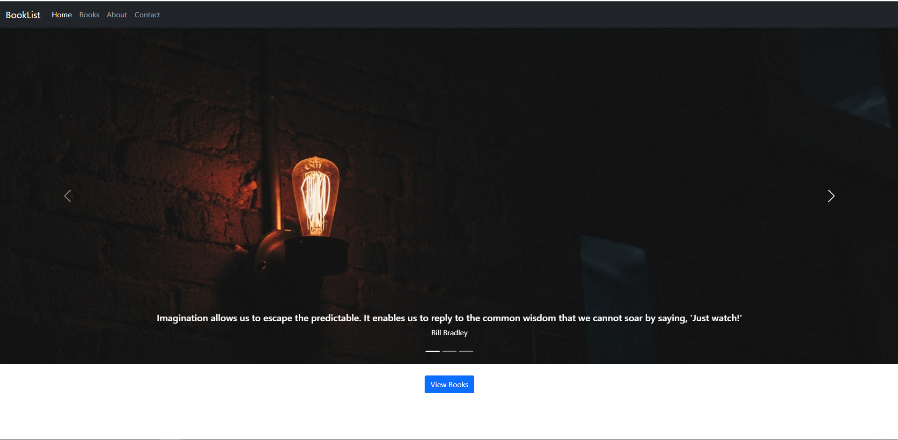
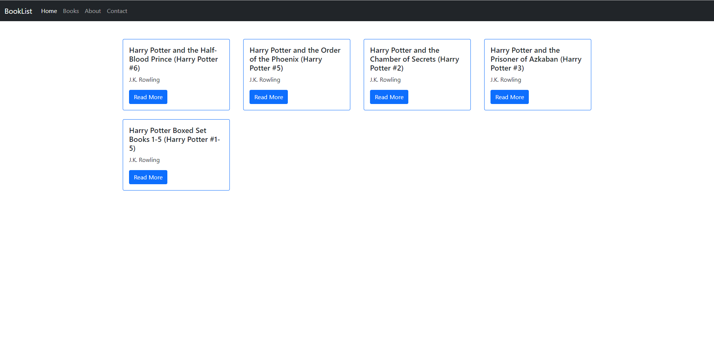
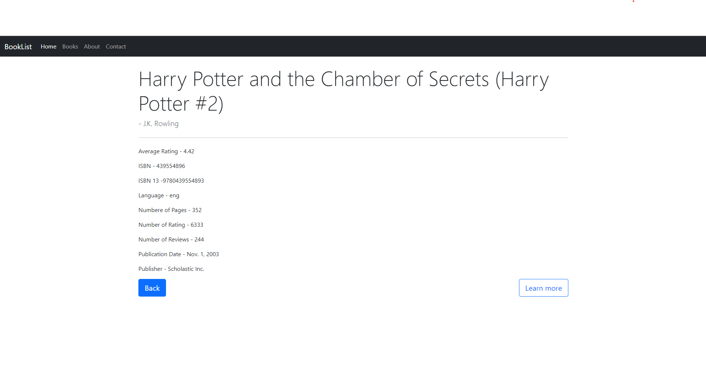
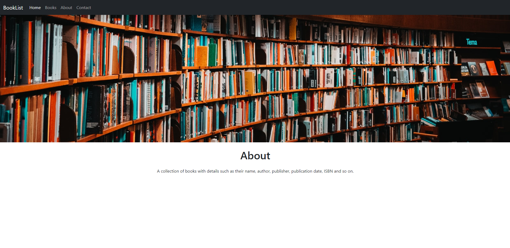
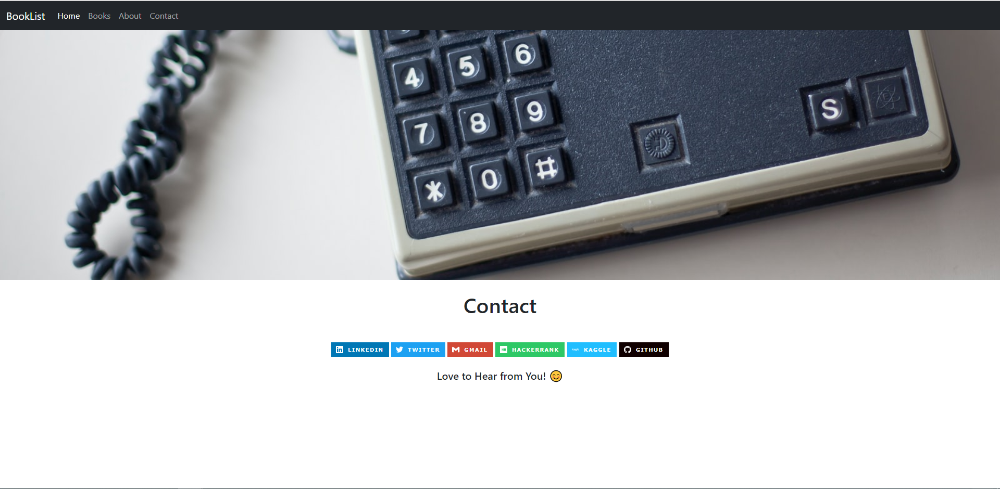

# Disney Movies Wikipedia WebScraper

## Table of Contents

* [About the Project](#about-the-project)
  * [Demo Pages](#demo-pages)
  * [Built With](#built-with)
* [Contact](#contact)

## About the Project

In this [`Django Project`](https://github.com/sinjoysaha/django-booklist) I try to build a book collection web app and demonstrate my skills in Django. The web app provides information such as `Title`, `Author`, `Average Rating`,  `ISBN`, `ISBN13`, `Number of Pages`, `Number of Ratings`, `Number of Reviews`,  `Publisher`, `Publication Date`. 

The data is taken from this Kaggle [dataset](https://www.kaggle.com/jealousleopard/goodreadsbooks) - Original Source: Goodreads. 

`Pandas` was used to clean and pre-process the data before storing it into a database.

## Demo Pages

### Built With

* Python
* Django
* HTML
* BootStrap
* Pandas 

## Contact

Sinjoy Saha 

  
  
  

